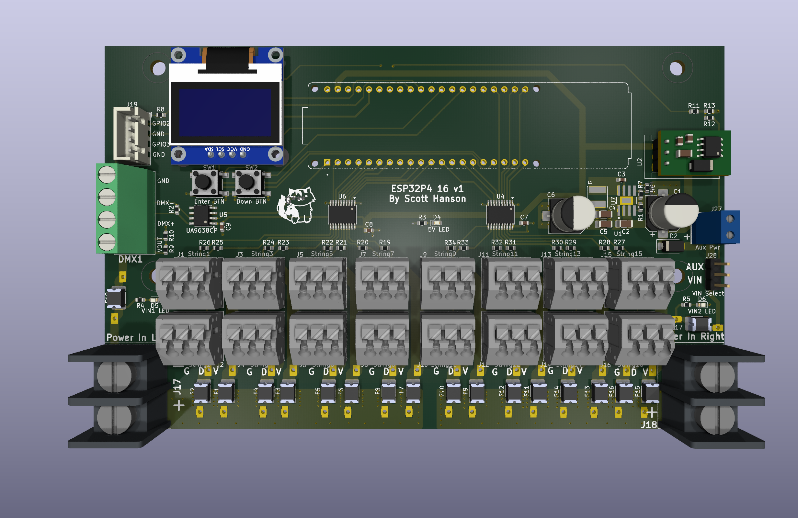

# SBPixel16

A 16-port WS2812 pixel controller built on the **ESP32-P4**. It drives all 16 LED
strips simultaneously using the ESP32-P4's PARLIO peripheral for glitch-free parallel
DMA output. Pixel data comes from Ethernet (E1.31/sACN or DDP) or from **FSEQ
sequences played off a microSD card** in a standalone loop.

> **⚠️ WIP — Do not use.** Both the hardware and firmware are under active
> development and have not been fully validated.

This repository contains both the open-source **hardware** (KiCad 10) and the
**firmware** (Arduino / ESP-IDF).

---

## Features

- **16 parallel pixel outputs** — all strips clocked out together via PARLIO DMA,
  no RMT channel juggling.
- **Network input** — E1.31 (sACN, UDP 5568) or DDP (UDP 4048), selectable at runtime.
- **Standalone FSEQ playback** — plays uncompressed FSEQ v2 sequences (full or sparse)
  from a microSD card, looping the whole `/sequences` folder forever. No network needed.
- **Single-universe DMX512 output** — optional, generated on UART1 (250 kbaud, 8N2).
- **Web UI + REST API** — configure network, protocol, and per-port settings from a
  browser; config persists in LittleFS as `/config.json`.
- **On-OLED network setup** — set DHCP / static IP / gateway from the front-panel
  buttons, no computer required.
- **Over-the-air updates** — firmware and filesystem images can be flashed from the web UI.
- **Per-port configuration** — pixel count, start channel, color order, brightness,
  null/sacrificial pixels, and pixel grouping.
- **On-board 128×64 SSD1306 OLED** — shows IP, protocol, FPS, packet count, input
  voltages, SD status, and the currently playing sequence.
- **Two input-voltage monitors** — oversampled ADC readings (V1/V2) shown on the OLED.
- **Built-in test patterns** — cycle red / green / blue / rainbow with the on-board
  buttons; power-up RGB self-test on every boot.

---

## Repository layout

```
.
├── firmware/SBPixel16/     Arduino sketch (ESP32-P4)
│   ├── SBPixel16.ino        main app: setup/loop, config, Ethernet, parsers
│   ├── SBPixel16.h          board pin map & config structs
│   ├── parlio_ws2812.h      PARLIO parallel WS2812 DMA driver
│   ├── dmx_output.h         single-universe DMX512 output
│   ├── fseq_player.h        microSD FSEQ v2 player (uncompressed/sparse)
│   ├── net_menu.h           two-button OLED network editor
│   ├── data/                web UI source (packed into the LittleFS image)
│   └── page_*.h             web UI pages + REST API handlers
├── hardware/                KiCad 10 project (schematics, PCB, libraries)
│   └── ESP32-P4_16.*        board design files
└── LICENSE                  CC BY-NC 4.0 (firmware)
```

---

## Firmware

### Target

- **Board:** ESP32-P4 (Arduino-ESP32 3.x), e.g. Waveshare ESP32-P4-ETH
- **Ethernet PHY:** IP101GRI (RMII)
- **microSD:** the module's SDIO slot (4-bit) — used for FSEQ playback
- **Partition:** Default 4MB with SPIFFS (1.2 MB app / 1.5 MB filesystem)

### Required libraries

Install via the Arduino Library Manager:

| Library | Source |
| --- | --- |
| ESPAsyncWebServer | github.com/me-no-dev/ESPAsyncWebServer |
| AsyncTCP | github.com/me-no-dev/AsyncTCP |
| ArduinoJson | arduinojson.org |
| Adafruit GFX + Adafruit SSD1306 | Adafruit (OLED display) |

### Build & flash

1. Install the ESP32 board package (Arduino-ESP32 **3.x**) and select an **ESP32-P4** board.
2. Set the partition scheme to **Default 4MB with SPIFFS**.
3. Open `firmware/SBPixel16/SBPixel16.ino`, compile, and upload.
4. Upload the web UI: flash the LittleFS filesystem image (the web pages served from
   `/`) — a prebuilt `SBPixel16.littlefs.bin` is provided, or re-flash it later over
   the air from the web UI.

On first boot with no `/config.json`, the firmware writes sensible defaults
(DHCP on, E1.31, 100 pixels/port, RGB order, 30% brightness).

### REST API

| Method | Endpoint | Purpose |
| --- | --- | --- |
| GET | `/api/status` | Runtime stats (FPS, packet counts, voltages, SD/FSEQ status) |
| GET | `/api/config` | Current configuration as JSON |
| POST | `/api/config` | Update configuration |
| POST | `/api/reboot` | Reboot the controller |
| POST | `/api/ota/firmware` | Upload a firmware image |
| POST | `/api/ota/filesystem` | Upload a filesystem (web UI) image |

### Key defaults

- Refresh rate: ~40 fps (25 ms frame interval)
- Max pixels per port: 340 (configurable in `SBPixel16.h`)
- Input protocols: `0` = E1.31, `1` = DDP, `2` = FSEQ (SD card)
- Data timeout: outputs blank after 1 s with no packets
- E1.31 UDP port 5568 · DDP UDP port 4048 · HTTP port 80

### Front-panel network setup

Static IP can be set without a computer using the two on-board buttons:

1. **Hold BTN1 (~1.5 s)** to open the `NETWORK SETUP` screen on the OLED.
2. **BTN1** changes the value under the cursor (hold to auto-repeat); **BTN2** moves to
   the next field. Order: DHCP on/off → IP → gateway → *Save & reboot*.
3. Selecting **Save** writes the config and reboots. 30 s of inactivity cancels.

Outside the menu, BTN1 cycles the test pattern and BTN2 stops it (unchanged).

### FSEQ playback (microSD)

Set the input protocol to **FSEQ** (Network page, or `protocol: 2`). On boot the
controller powers and mounts the module's microSD slot and scans **`/sequences`** for
`*.fseq` files. It plays them alphabetically and loops the whole folder forever — no
network connection required.

- **Format:** FSEQ v2, **uncompressed only** (full or sparse frames). Export from
  xLights / FPP with *No Compression*. Compressed files are skipped.
- **Channel mapping:** frame channels map to ports by each port's **Start Ch.**, exactly
  like E1.31/DDP — so brightness, color order, and grouping all still apply.
- The OLED and the web dashboard show the mounted card and the sequence now playing.

---

## Hardware

The board is a KiCad 10 open-hardware design (`hardware/ESP32-P4_16.*`) with 16 buffered
pixel outputs, dual power inputs with voltage monitoring, an SSD1306 OLED, two buttons,
and RMII Ethernet.

Design files, interactive BOM, and part list are published on the upstream project:

- **Interactive BOM:** https://computergeek1507.github.io/PB_16/ESP32-P4_16/bom/ibom
- **Part BOM (.ods):** https://github.com/computergeek1507/PB_16/raw/master/ESP32-P4_16/ESP32-P4_16_BOM.ods



---

## Licensing

Both the **firmware** and the **hardware** are licensed under **CC BY-NC 4.0**
(see [LICENSE](LICENSE)) — free to share and adapt for non-commercial use with
attribution.

Copyright © 2025 Scott Hanson.
